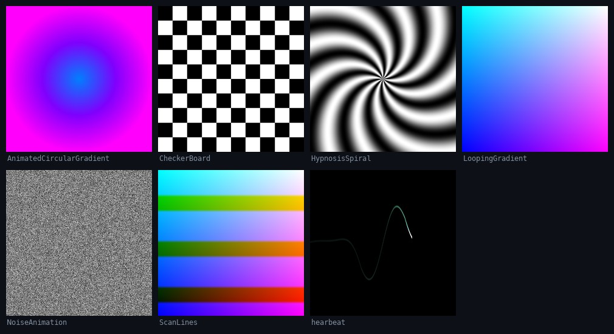

# Shader Library

Standalone fragment shaders. Each file is one `main()` against a `resolution`
and `time` uniform pair, with no framework around it, so they drop into whatever
you already have.



Every image above is the actual output, rendered headless at 512 by 512 with
`time` fixed at 1.7. Full-size PNGs are in [`docs/`](docs/).

## The shaders

| File | What it draws |
|---|---|
| [`HypnosisSpiral.h`](HypnosisSpiral.h) | `sin(angle * 10 - radius * 20)` in polar coordinates. Ten arms, tightening toward the centre. |
| [`AnimatedCircularGradient.h`](AnimatedCircularGradient.h) | Radial gradient with the colour driven by time. |
| [`CheckerBoard.h`](CheckerBoard.h) | Procedural checkerboard. |
| [`LoopingGradient.h`](LoopingGradient.h) | Colour gradient that returns to where it started. |
| [`NoiseAnimation.h`](NoiseAnimation.h) | Hash-based noise field, reseeded each frame. |
| [`ScanLines.h`](ScanLines.h) | Horizontal bands over a gradient. |
| [`hearbeat.h`](hearbeat.h) | A waveform plotted as a line, in the shape of a heartbeat trace. The filename is misspelled and stays that way so existing links keep working. |

## Metal

[`DynamicColourGradient/DynamicColourGradient_metal.h`](DynamicColourGradient/DynamicColourGradient_metal.h)
is the same idea written for Metal, taking `resolution` and `time` through
buffer bindings instead of uniforms.

```metal
fragment float4 fragmentShader (float2 fragCoord [[position]],
                                constant float2 &resolution [[buffer(0)]],
                                constant float &time [[buffer(1)]])
```

## Known gap

`DynamicColourGradient.h` is empty. The Metal version above is the only
implementation of it. Anything that includes the GLSL file will fail to link
with `No definition of main in fragment shader`.

## Use

```glsl
uniform vec2  resolution;   // viewport size in pixels
uniform float time;         // seconds
```

Paste the body into any host that provides those two and writes `gl_FragColor`.
`hearbeat.h` writes `fragColor` instead, so it needs an `out vec4 fragColor` on
a core profile.

## Rendering these yourself

The contact sheet came from a standalone OpenGL 3.3 context with no window. Each
file is wrapped rather than edited: the wrapper supplies the `#version`, the
uniforms and an `out` variable, and rewrites `gl_FragColor` to it, so the shader
sources stay exactly as they are.
